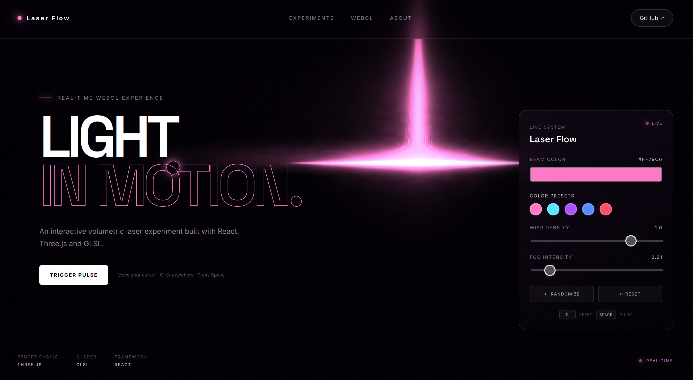

# ✦ Laser Flow — Interactive WebGL Experience

A cinematic, interactive laser-flow experience built with **React, TypeScript, Three.js, and GLSL**.

An experimental WebGL showcase featuring mouse interaction, customizable laser colors, live controls, animated wisps, fog intensity, and interactive pulse effects.

## ✨ Preview



## 🎯 About the Project

**Laser Flow** is an interactive WebGL experiment created to explore real-time visual effects on the web.

The project combines a volumetric laser shader with a minimal futuristic interface to create an immersive visual experience.

Move your cursor around the screen, experiment with different laser settings, change colors, and trigger the laser pulse in real time.

## 🚀 Features

- ✦ Real-time WebGL laser effect
- 🖱️ Mouse-responsive laser movement
- ⚡ Interactive laser pulse
- 🎨 Custom beam color
- 🌈 Multiple color presets
- 🌫️ Adjustable fog intensity
- ✨ Adjustable wisp density
- 🎲 Randomize laser configuration
- ↺ Reset effect
- ⌨️ Keyboard shortcuts
- 📱 Responsive interface
- ⚡ Real-time Three.js rendering
- 🧪 Custom GLSL shader
- 🎛️ Interactive control panel

## 🖱️ Interactions

| Interaction   | Action                                |
| ------------- | ------------------------------------- |
| Move mouse    | Interact with the laser               |
| Trigger Pulse | Create an interactive laser pulse     |
| `SPACE`       | Trigger laser pulse                   |
| `R`           | Reset settings                        |
| Color picker  | Change laser color                    |
| Color presets | Switch between predefined colors      |
| Wisp Density  | Adjust animated wisps                 |
| Fog Intensity | Adjust volumetric fog                 |
| Randomize     | Generate a random laser configuration |
| Reset         | Restore default settings              |

## 🎨 Color Presets

The showcase includes several built-in laser colors:

- Pink
- Cyan
- Purple
- Blue
- Red

You can also choose a custom color using the color picker.

## 🛠️ Tech Stack

- **React**
- **TypeScript**
- **Three.js**
- **GLSL**
- **Vite**
- **CSS**
- **Oxlint**

## 📁 Project Structure

```text
laser-flow-showcase/
│
├── public/
│
├── src/
│   ├── assets/
│   │   └── laser-flow-preview.png
│   │
│   ├── components/
│   │   └── LaserFlow.tsx
│   │
│   ├── App.tsx
│   ├── index.css
│   └── main.tsx
│
├── .gitignore
├── index.html
├── package.json
├── package-lock.json
├── tsconfig.json
├── tsconfig.app.json
├── tsconfig.node.json
├── vite.config.ts
└── README.md
```
